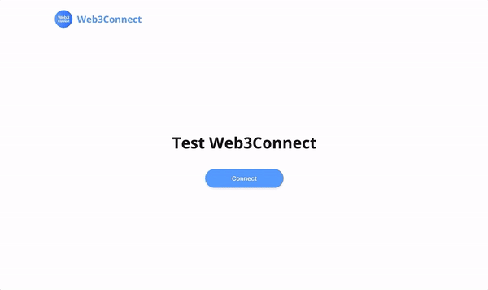

# Web3Connect

A single Web3 / Ethereum provider solution for all Wallets

## Introduction

Web3Connect is an easy-to-use library to help developers add support for multiple providers in their apps with a simple customizable configuration.

By default Web3Connect Library supports injected providers like (**Metamask**, **Dapper**, **Gnosis Safe**, Web3 Browsers, etc) and **WalletConnect**, You can also easily configure the library to support **Portis**, **Fortmatic**, **Squarelink**, **Torus**, **Authereum** and **Arkane**.

## Preview

You can test the library on: https://web3connect.com/



## Usage

1. Install Web3Connect NPM package

```bash
npm install --save web3connect

# OR

yarn add web3connect
```

2. Install Provider packages

See Providers Options Section for each provider

3. Then you can add Web3Connect to your Dapp as follows

```js
import Web3Connect from "web3connect";

const providerOptions = {
  /* See Provider Options Section */
};

const web3Connect = new Web3Connect.Core({
  network: "mainnet", // optional
  providerOptions: providerOptions
});

// subscribe to connect
web3Connect.on("connect", (provider: any) => {
  const web3 = new Web3(provider); // add provider to web3
});

// subscribe to close
web3Connect.on("close", () => {
  console.log("Web3Connect Modal Closed"); // modal has closed
});

web3Connect.toggleModal(); // open modal on button click
```

## Provider Options

These are all the providers available with Web3Connect and how to configure their provider options

### WalletConnect

1. Install Provider Package

```bash
npm install --save @walletconnect/web3-provider

# OR

yarn add @walletconnect/web3-provider
```

2. Set Provider Options

```typescript
import WalletConnectProvider from "@walletconnect/web3-provider";

const providerOptions = {
  walletconnect: {
    package: WalletConnectProvider, // required
    options: {
      infuraId: "INFURA_ID" // required
    }
  }
};
```

### Portis

1. Install Provider Package

```bash
npm install --save @portis/web3

# OR

yarn add @portis/web3
```

2. Set Provider Options

```typescript
import Portis from "@portis/web3";

const providerOptions = {
  portis: {
    package: Portis, // required
    options: {
      id: "PORTIS_ID" // required
    }
  }
};
```

### Fortmatic

1. Install Provider Package

```bash
npm install --save fortmatic

# OR

yarn add fortmatic
```

2. Set Provider Options

```typescript
import Fortmatic from "fortmatic";

const providerOptions = {
  fortmatic: {
    package: Fortmatic, // required
    options: {
      key: "FORTMATIC_KEY" // required
    }
  }
};
```

### Squarelink

1. Install Provider Package

```bash
npm install --save squarelink

# OR

yarn add squarelink
```

2. Set Provider Options

```typescript
import Squarelink from "squarelink";

const providerOptions = {
  squarelink: {
    package: Squarelink, // required
    options: {
      id: "SQUARELINK_ID" // required
    }
  }
};
```

### Torus

1. Install Provider Package

```bash
npm install --save @toruslabs/torus-embed

# OR

yarn add @toruslabs/torus-embed
```

2. Set Provider Options

```typescript
import Torus from "@toruslabs/torus-embed";

const providerOptions = {
  torus: {
    package: Torus, // required
    options: {
      enableLogging: false, // optional
      buttonPosition: "bottom-left", // optional
      buildEnv: "production", // optional
      showTorusButton: true, // optional
      enabledVerifiers: {
        // optional
        google: false // optional
      }
    }
  }
};
```

### Arkane

1. Install Provider Package

```bash
npm install --save @arkane-network/web3-arkane-provide

# OR

yarn add @arkane-network/web3-arkane-provide
```

2. Set Provider Options

```typescript
import Arkane from "@arkane-network/web3-arkane-provider";

const providerOptions = {
  arkane: {
    package: Arkane, // required
    options: {
      clientId: "ARKANE_CLIENT_ID" // required, replace
    }
  }
};
```

### Authereum

1. Install Provider Package

```bash
npm install --save authereum

# OR

yarn add authereum
```

2. Set Provider Options

```typescript
import Authereum from "authereum";

const providerOptions = {
  authereum: {
    package: Authereum, // required
    options: {}
  }
};
```

### BurnerConnect

1. Install Provider Package

```bash
npm install --save @burner-wallet/burner-connect-provider

# OR

yarn add @burner-wallet/burner-connect-provider
```

2. Set Provider Options

```typescript
import BurnerConnectProvider from "@burner-wallet/burner-connect-provider";

const providerOptions = {
  burnerconnect: {
    package: BurnerConnectProvider, // required
    options: {}
  }
};
```

## Utils

```typescript
function checkInjectedProviders(): IInjectedProvidersMap;
function getInjectedProviderName(): string | null;
function getProviderInfoByName(name: string | null): IProviderInfo;
function getProviderInfo(provider: any): IProviderInfo;
function isMobile(): boolean;
function formatProviderDescription(providerInfo: IProviderInfo);
```

## Types

```typescript
interface IProviderInfo {
  name: string;
  type: string;
  logo: string;
  check: string;
  styled: {
    [prop: string]: any;
  };
}

interface IProviderOptions {
  [providerName: string]: {
    package: any;
    options: any;
  };
}

interface IInjectedProvidersMap {
  injectedAvailable: boolean;
  [isProviderName: string]: boolean;
}

interface IProviderCallback {
  name: string | null;
  onClick: () => Promise<void>;
}
```

## Optional Flags

### Disable Injected Provider

By default is set to `false` and Web3Connect always displays InjectedProvider as an option to the user if available. However you can disable it as an optional flag if you desire:

```javascript
const web3Connect = new Web3Connect.Core({ disableInjectedProvider: true });
```

### Cache Provider

By default is set to `false` and Web3Connect will always require the user to choose a provider option before triggering the onConnect event. However you can enable caching the last chosen provider. Example:

```javascript
const web3Connect = new Web3Connect.Core({ cacheProvider: true });
```

There are four options for this flag: `false`, `true`, `onclick` and `onload`. Here are the expected behaviors for each one of them:

- If `false`, it will always display the modal to choose a provider.
- If `true` or `onclick`, it will connect to the last chosen provider on `toggleModal` or button click
- If `onload`, it will connect to the last chosen provider on page load where Web3Connect is instantiated

If you wish to reset the cached provider you can call the following method:

```typescript
web3Connect.clearCachedProvider();
```

## Adding a new provider

Do you want to add your provider to Web3Connect? All logic for supported providers lives inside the `src/providers` directory. To add a new follow the following steps [here](ADDING_PROVIDERS.md)

## Collaboration

### Code contributions are welcome ❤️❤️❤️!

If you wish to support a new provider submit a issue to the repo or fork this repo and create a pull request.

You can join to our discord to further discuss https://discordapp.com/invite/YGnSX9y
